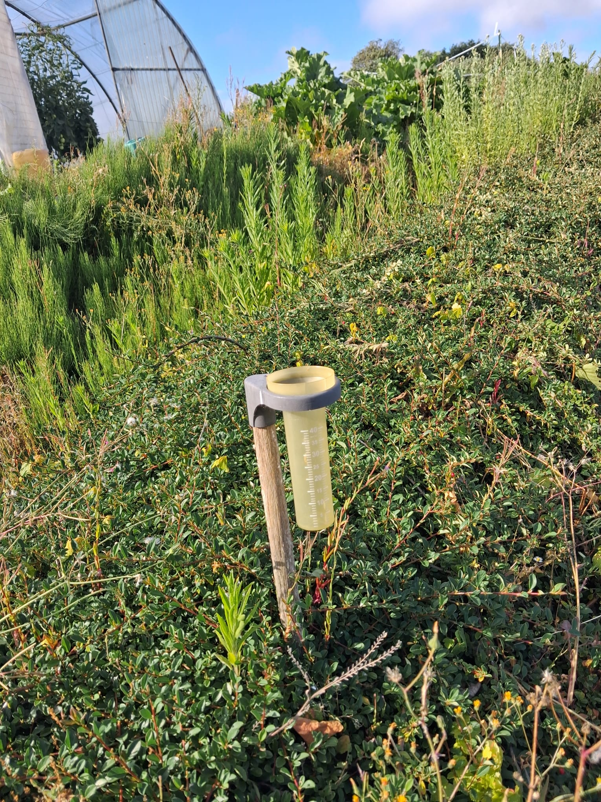

```{r setup}
library(dplyr)
library(tidyr)
library(ggplot2)
library(crosstalk)
library(plotly)
library(htmltools)

pluie <- read.csv("pluie.csv",sep=";", header=TRUE)

pluie <- pluie %>%
  gather("mois", "mm", 2:13)

pluie$mm <- as.numeric(pluie$mm)
pluie$annee <- as.factor(pluie$annee)
pluie$mois <- factor(pluie$mois, levels = c("janvier", "fevrier", "mars",
                                            "avril", "mai", "juin", "juillet",
                                            "aout", "septembre", "octobre", 
                                            "novembre", "decembre"))
```

# Accueil {.tabset}

::: {.card}

**Bienvenu sur le tableau de bord pluviométrique de Daniel !**

<br>

::: {.columns}

::: {.column width="70%"}

Depuis 2007, ce petit pluviomètre (oui, celui en photo) est consulté chaque jour, ou presque, par Daniel, ancien agriculteur, et jardinier amateur à ses heures perdues, avec une régularité qui ferait pâlir bien des stations météorologiques. Relevé après relevé, il a permis de constituer une base de données unique retraçant près de vingt ans de pluie bretonne au lieu dit le Le Gouret (anciennement Kermorvan pour les locaux).

Ici, pas de modèles climatiques à plusieurs millions d'euros, pas de satellites ni de supercalculateurs… juste un pluviomètre, des calendriers et beaucoup de persévérance. Une approche artisanale qui n'a rien à envier aux grandes institutions… enfin, tant qu'on ne demande pas la météo de demain !

Ce tableau de bord vous invite à explorer ces relevés : comparer les années, rechercher les épisodes les plus pluvieux ou simplement vérifier si « *il pleuvait vraiment plus avant* ».

:::

::: {.column width="30%"}
{width="100%"}
:::

:::

N'hésitez pas à parcourir l'ensemble des onglets à votre disposition. Les graphiques sont interactifs et peuvent être visualiser en grand écran en cliquant sur le bouton en bas à droite de l'encart.

:::

Crédits : 

- Collecte des données : Daniel
- Création et maintenance de l'application : Marine


# Visualisation annuelle {.tabset}

```{r}
shared_pluie <- highlight_key(pluie)

# shared_pluie <- SharedData$new(pluie)

filtre_annee <- filter_select(
  id = "filtre_annee",
  label = "Année",
  sharedData = shared_pluie,
  group = ~annee,
  multiple = FALSE
)


p <- plot_ly(
  data = shared_pluie,
  x = ~mois,
  y = ~mm,
  type = "bar",
  marker = list(color = ~mm)
)


bscols(
  widths = c(2, 9),
  filtre_annee,
  p
  
)
```


# Synthèse annuelle {.tabset}

## {.tabset}

```{r}
#| title: "Vue d'ensemble"
gg_annee <- ggplot(pluie) +
  aes(x = mois, y = mm, fill=mm, 
      text= paste0(mois, " ", annee, "<br>",mm," mm")) +
  scale_fill_gradient(high = "#132B43", low = "#56B1F7")+
  geom_col() +
  # scale_y_continuous(breaks=seq(0,220,25), limits = c(0,225)) +
  labs(x="", y="") +
  facet_wrap(~annee) +
  theme_bw() + 
  theme(legend.position='none',
        axis.text.x = element_text(angle = 40, hjust=1, size = 8))

plotly::ggplotly(gg_annee, tooltip = "text")
```


```{r}
#| title: 'Cumul annuel'
cumul <- pluie %>%
  group_by(annee) %>%
  summarise(tot=sum(mm,na.rm=TRUE))


gg_cumul <- 
  ggplot(cumul) +
  aes(x = annee, y = tot, fill = tot) + 
  scale_fill_gradient(high = "#132B43", low = "#56B1F7")+
  geom_col() +
  labs(x="", y="") +
  theme_bw() + theme(legend.position='none') 

ggplotly(gg_cumul,
         tooltip = "tot")
```


# Visualisation mensuelle {.tabset}

```{r}
shared_pluie2 <- highlight_key(pluie)

filtre_mois <- filter_select(id = "filtre_mois", label = "Mois", 
                  sharedData = shared_pluie2, 
                  group = ~mois, 
                  multiple = FALSE)


p2 <- plot_ly(
  data = shared_pluie2,
  x = ~annee,
  y = ~mm,
  type = "bar",
  marker = list(color = ~mm)
)

bscols(
  widths = c(2, 9),
  filtre_mois,
  p2
  
)
```


# Épisodes remarquables {.tabset}

